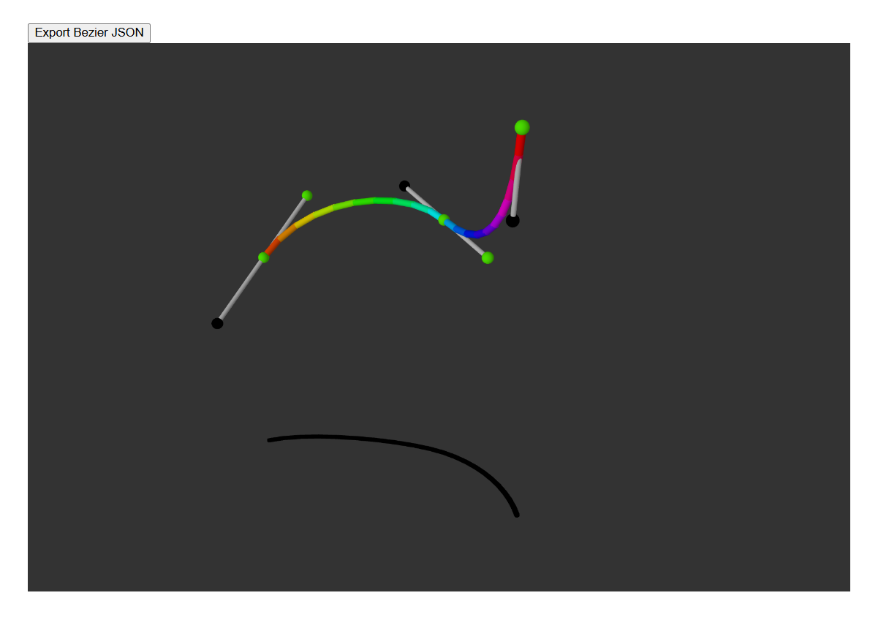

# 3D-Bezier-Curve-Editor
Create and edit 3D Bezier curves in the browser, export the array of anchor and control points as a JSON

### [Try It Out](https://camelcasesensitive.github.io/3D-Bezier-Curve-Editor/)

  

Here's a 3D Elephant Bezier curve I made with this https://www.desmos.com/3d/md2lao6l8m?lang=en 
